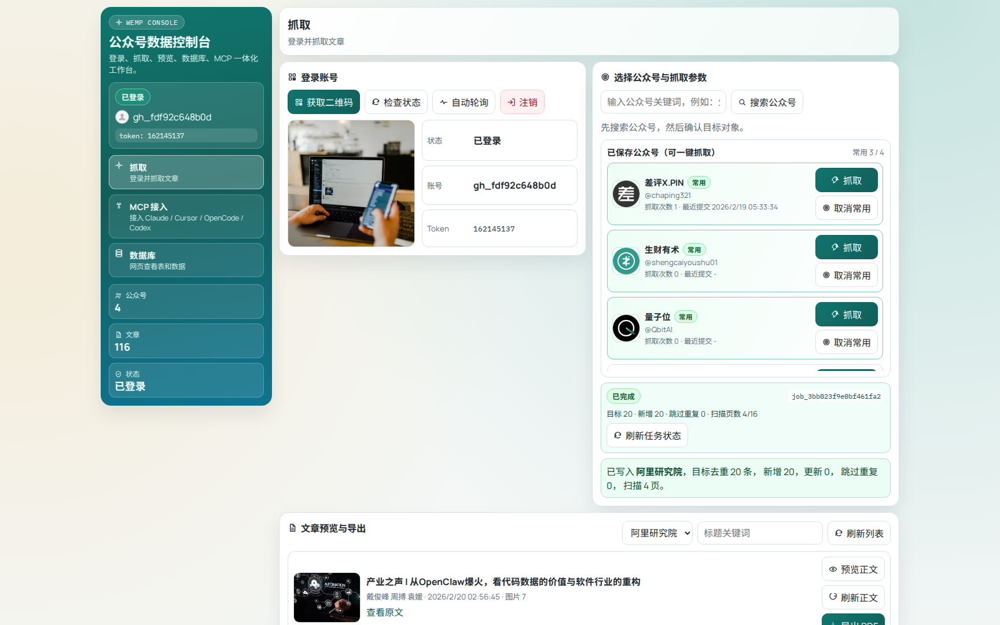
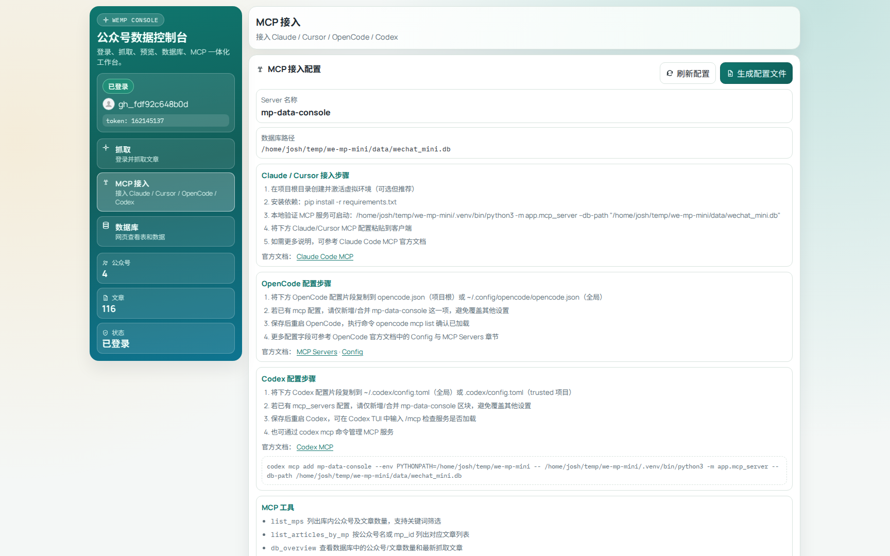
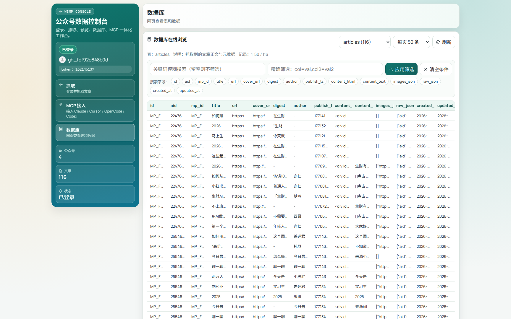
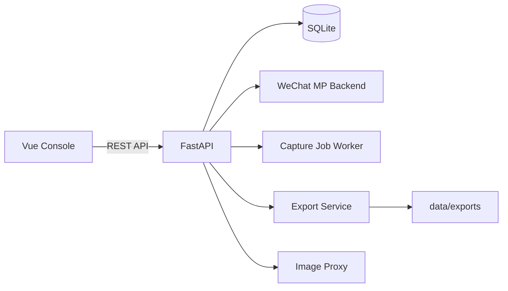
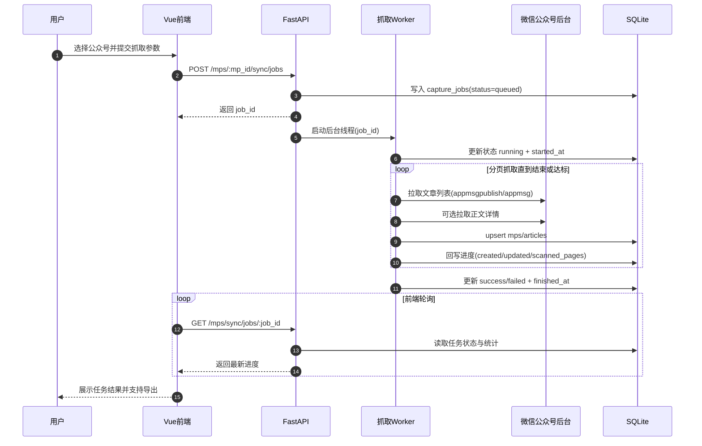

# mp-data-console · AI 可接入的公众号数据控制台


一个面向个人/小团队的微信公众号文本数据底座：扫码登录、搜索确认、后台抓取、正文预览、导出、数据库浏览、MCP 接入一站式完成，让 AI 能直接消费公众号文本做数据挖掘与分析。

## 这个项目解决什么问题

- AI 缺少可用数据源：公众号正文分散在微信后台，无法被大模型稳定访问。
- 数据沉淀困难：抓取、清洗、去重、入库链路分散，难形成可复用的数据资产。
- 分析流程割裂：抓取和 AI 工具脱节，无法快速完成检索、摘要、主题归纳与问答。

这个项目的目标是把流程做成**AI 可消费的低心智负担控制台**：前端负责采集与可视化，后端负责入库与任务管理，MCP 负责把结构化文本安全地暴露给 AI 工具。

## 核心价值（不仅是抓取）

- 数据资产化：把公众号正文持续沉淀为可检索、可复用、可追溯的本地文本库。
- AI 可直连：通过 MCP 直接把标题、正文与元数据暴露给大模型，不再手工复制粘贴。
- 分析可落地：支持从“抓取数据”走到“摘要、分类、对比、趋势洞察”的完整闭环。
- 协作可扩展：个人可自用，小团队可共享同一套数据口径与分析流程。

## 适用人群

- 内容团队：做选题雷达、爆款拆解、竞品账号跟踪。
- 投研/咨询团队：沉淀行业观点，做主题归因与长期观察。
- AI 应用开发者：把公众号文本作为 RAG/Agent 的稳定数据源。

## 和传统方式相比

| 维度 | 传统方式 | mp-data-console |
|---|---|---|
| 数据获取 | 手工登录 + 零散复制 | 后台任务批量抓取 + 去重入库 |
| 数据形态 | 网页片段，难复用 | SQLite 全文 + 元数据，结构化沉淀 |
| AI 接入 | 复制粘贴给模型，链路不稳定 | MCP 工具直连，查询与分析可复现 |
| 产出效率 | 人工通读，耗时高 | AI 先筛选再深读，显著缩短分析周期 |

## 界面预览

<!-- README_IMAGES:START -->
| 抓取视图 | MCP 接入 | 数据库 |
| --- | --- | --- |
|  |  |  |
<!-- README_IMAGES:END -->

## 核心能力

### 抓取链路

- 扫码登录微信公众号后台（含状态轮询与会话恢复）
- 公众号搜索与抓取前确认（头像、别名、时间范围）
- 后台抓取任务（`queued/running/canceling/success/failed/canceled`）
- 时间范围抓取：只按 `date_start ~ date_end` 设定抓取窗口
- 常用公众号自动同步：支持按频率增量抓取（回看天数 + 重叠小时）与全局开关
- 任务中心：任务历史、筛选、详情日志、取消与重试

### 内容与导出

- 抓取文章列表 + 正文
- 正文在线预览（处理隐藏样式和图片防盗链问题）
- 导出 Markdown / HTML / PDF
- 批量导出 ZIP

### 数据与运维

- 数据库在线浏览（分页、关键词、指定字段搜索、精确过滤）
- 表注释 / 列注释展示
- MCP 文章文本服务配置一键生成（直连 SQLite）
- 图片代理与导出图片本地化，降低防盗链导致的丢图

### AI 接入与文本分析

- 通过 MCP 直接读取公众号正文（标题 + 全文 + 元数据）
- 支持在 Claude Desktop / Cursor / OpenCode / Codex 中即插即用
- 提供 `search_articles` / `get_article_text` 等工具，便于 AI 检索与长文分析
- 为分类、摘要、关键信息抽取、主题趋势分析提供统一文本数据入口

## 典型分析场景（可直接交给 AI）

1. 选题趋势监测：统计过去 30 天某垂类公众号高频主题、叙事角度与发布时间规律。
2. 竞品内容对标：对比多个账号在同一时间窗口的选题重合度与表达差异。
3. 长文快速提炼：对单篇或多篇文章抽取核心结论、关键事实与可执行建议。

示例提示词：

```text
请基于最近 30 天抓取的「AI 行业」相关公众号文章，输出：
1) 高频主题 Top 10
2) 每个主题的代表文章与关键观点
3) 下周可执行的 5 个选题建议
```

## 架构概览



### AI 数据流（从公众号到洞察）


## 实现原理（核心机制）

### 1) 扫码登录 + 会话恢复

- 后端通过 `requests.Session` 模拟公众号后台会话，请求微信首页提取二维码参数；若页面结构变化，自动回退到 `startlogin + scanloginqrcode` 流程生成二维码。
- 轮询登录状态时，根据微信状态码映射为 `waiting_scan / scanned / logged_in / expired`，扫码成功后再调用登录接口完成 token 建立。
- token 不是单点来源：会从响应 JSON、URL、页面文本、Cookie、历史 token 多路提取，并用 `switchacct` 接口校验可用性，降低偶发失败。
- 会话信息（token、cookie、fingerprint、状态）持久化在 `auth_sessions`；服务重启后会自动恢复，并在 token 仍有效时回写为 `logged_in`。

### 2) 公众号与文章抓取

- 公众号先搜索后入库，按 `fakeid`（必要时 `biz`）做 upsert，避免重复创建。
- 抓取文章时优先使用 `appmsgpublish`，若返回空再回退 `appmsg`，提升兼容性。
- 每页按 5 条扫描，任务内用 `url + aid` 双键去重，重复项计入 `duplicates_skipped`。
- 按时间范围抓取：扫描会在触达时间窗口下界后自动停止。

### 3) 后台任务执行模型

- 前端提交抓取后，后端先写入 `capture_jobs`（`queued`），再启动守护线程异步执行，不阻塞接口返回。
- 运行中持续把 `created/updated/content_updated/scanned_pages/max_pages` 回写数据库，前端可轮询得到实时进度。
- 服务内用互斥锁保证同一时刻只跑一个抓取 worker，避免并发抓取导致登录态冲突与频控风险。
- 若进程异常重启，数据库里遗留的 `queued/running` 任务会在下次查询时自动标记为 `failed`，并提示“任务进程已中断”。



### 4) 正文解析与反爬兼容

- 正文抓取后使用 `BeautifulSoup` 解析 `#js_content/#js_article`，移除脚本样式，并清理 `visibility:hidden`、`opacity:0`、`display:none` 等常见隐藏样式。
- 图片链接统一回填到可用 `src`（优先 `data-src`），同时提取 `content_text`、封面、作者、发布时间等字段。
- 遇到“当前环境异常，完成验证后即可继续访问”页面时，自动回退 Playwright，并复用登录 cookie 获取可渲染正文。

### 5) 导出与图片防盗链处理

- Markdown 导出时将图片地址改写为本地图片代理接口，减少外链防盗链导致的失效。
- HTML/PDF 导出会尝试把正文图片下载到本地 `assets` 目录并重写相对路径；下载失败再降级为代理链接。
- 图片代理仅允许微信相关域名，使用 `sha256(url)` 做缓存键，二进制 + 元信息分离存储，默认 7 天 TTL，支持重试与内容类型嗅探。
- 批量导出时会把文章文件和对应 `assets` 一并打包 ZIP，下载接口带路径校验，防止越权读取。

## 环境要求

- Python 3.11+
- Node.js 20+
- Linux / macOS / Windows

如果需要 PDF 导出，请安装 Playwright 浏览器：

```bash
playwright install chromium
```

## 3 分钟上手（推荐）

```bash
./dev.sh
```

脚本会自动检测依赖是否需要安装（`requirements.txt` / `web/package-lock.json` 变化会自动重装）。

强制重新安装依赖：

```bash
./dev.sh up --install
```

安装 PDF 导出依赖（Chromium）：

```bash
./dev.sh up --install-playwright
```

停止服务：

```bash
./dev.sh down
```

重启服务：

```bash
./dev.sh restart
```

默认访问地址：

- 前端：`http://127.0.0.1:5173`
- 后端：`http://127.0.0.1:18011`
- API 文档：`http://127.0.0.1:18011/docs`

## 5 分钟拿到第一份 AI 分析结果

1. 运行 `./dev.sh`，打开前端扫码登录并抓取 1~2 个公众号（建议先抓 20~50 篇，含正文）。
2. 在「MCP 接入」页点击“刷新配置”，复制对应客户端配置（OpenCode / Codex / Claude / Cursor）。
3. 在你的 AI 客户端加载 MCP 后，先调用 `list_mps` 和 `search_articles` 确认数据已可读。
4. 发送分析指令（示例）：

```text
请对最近 30 天「新能源」相关公众号文章做分析：
- 总结 5 个高频主题及其代表观点
- 提取各主题的分歧点和共识点
- 给出 3 条值得继续跟踪的信号
```

5. 如需交付结果，可在控制台导出 Markdown / HTML / PDF，或批量打包 ZIP。

## 手动启动（可选）

### 后端

```bash
python3 -m venv .venv
source .venv/bin/activate
pip install -r requirements.txt
cp .env.example .env
uvicorn app.main:app --host 0.0.0.0 --port 18011 --reload
```

### 前端

```bash
cd web
npm install
cp .env.example .env
npm run dev
```

## 典型使用流程（UI）

1. 获取二维码并扫码登录
2. 搜索公众号并确认抓取目标
3. 设置抓取时间范围（开始日期 / 结束日期，或快捷范围）
4. 提交抓取任务（任务进入后台执行，可离开当前页面）
5. 回来查看任务状态（新增/更新/重复跳过/扫描进度）
6. 在文章区预览正文并导出
7. 在 MCP 客户端连接本地数据库，让 AI 执行检索、摘要与文本挖掘

## API 快速索引（默认前缀：`/api/v1`）

### 认证

- `GET /auth/qr`
- `GET /auth/qr/image`
- `GET /auth/status`
- `GET /auth/session`
- `POST /auth/logout`

### 公众号与抓取

- `GET /mps/search?keyword=关键词`
- `POST /mps`
- `GET /mps`（支持 `favorite_only=true` 仅看常用）
- `PATCH /mps/{mp_id}/favorite`（设为/取消常用）
- `PATCH /mps/{mp_id}/auto-sync`（配置自动同步策略）
- `POST /mps/{mp_id}/sync/jobs`（后台任务，推荐）
- `GET /mps/sync/jobs`
- `GET /mps/sync/jobs/{job_id}`
- `GET /mps/sync/jobs/{job_id}/logs`
- `POST /mps/sync/jobs/{job_id}/cancel`
- `POST /mps/sync/jobs/{job_id}/retry`
- `POST /mps/{mp_id}/sync`（阻塞模式，兼容保留）

### 文章与导出

- `GET /articles`
- `GET /articles/{article_id}`
- `POST /articles/{article_id}/refresh`
- `POST /exports/article/{article_id}`
- `POST /exports/batch`
- `GET /exports/files/{relative_path}`

### 运维与工具

- `GET /ops/overview`
- `POST /ops/quick-sync`
- `GET /ops/auto-sync/status`
- `PATCH /ops/auto-sync/enabled`
- `POST /ops/auto-sync/run-now`
- `GET /ops/db/tables`
- `GET /ops/db/table/{table_name}`
- `GET /ops/mcp/config`
- `POST /ops/mcp/generate-file`
- `GET /assets/image?url=<原图地址>`

## MCP 访问 SQLite 正文（AI 接入核心）

项目内置了 MCP 服务模块 `app.mcp_server`，可直接读取 SQLite 中的文章正文文本（`articles.content_text`），便于在 Claude Desktop / Cursor / OpenCode / Codex 等 MCP 客户端里做问答、检索、摘要与主题分析。

### 1) 安装

```bash
python3 -m venv .venv
source .venv/bin/activate
pip install -r requirements.txt
```

### 2) 本地启动 MCP（可选，用于调试）

```bash
python3 -m app.mcp_server --db-path "$(pwd)/data/wechat_mini.db"
```

### 3) 获取可直接粘贴的 MCP 配置

方式 A：在前端「MCP 接入」页点击“刷新配置 / 生成配置文件”  
方式 B：直接调用接口：

```bash
curl "http://127.0.0.1:18011/api/v1/ops/mcp/config"
```

返回中的 `claude_config_json`（兼容字段 `config_json`）可直接用于 Claude / Cursor，例如：

```json
{
  "mcpServers": {
    "mp-data-console": {
      "command": "/abs/path/to/python",
      "args": [
        "-m",
        "app.mcp_server",
        "--db-path",
        "/abs/path/to/data/wechat_mini.db"
      ]
    }
  }
}
```

OpenCode 请使用 `opencode_config_json`（`opencode.json` 配置片段），例如：

```json
{
  "$schema": "https://opencode.ai/config.json",
  "mcp": {
    "mp-data-console": {
      "type": "local",
      "enabled": true,
      "command": [
        "/abs/path/to/python",
        "-m",
        "app.mcp_server",
        "--db-path",
        "/abs/path/to/data/wechat_mini.db"
      ],
      "environment": {
        "PYTHONPATH": "/abs/path/to/we-mp-mini"
      }
    }
  }
}
```

OpenCode 配置位置：

- 项目级：项目根 `opencode.json`
- 全局：`~/.config/opencode/opencode.json`

保存后可执行：

```bash
opencode mcp list
```

Codex 请使用 `codex_config_toml`（`config.toml` 配置片段），例如：

```toml
[mcp_servers.mp-data-console]
command = "/abs/path/to/python"
args = ["-m", "app.mcp_server", "--db-path", "/abs/path/to/data/wechat_mini.db"]

[mcp_servers.mp-data-console.env]
PYTHONPATH = "/abs/path/to/we-mp-mini"
```

Codex 配置位置：

- 全局：`~/.codex/config.toml`
- 项目级：`.codex/config.toml`（仅 trusted 项目生效）

也可以直接使用 `codex_cli_add_command`（CLI 一键添加命令），例如：

```bash
codex mcp add mp-data-console --env PYTHONPATH="/abs/path/to/we-mp-mini" -- /abs/path/to/python -m app.mcp_server --db-path "/abs/path/to/data/wechat_mini.db"
```

保存后可在 Codex TUI 输入 `/mcp` 查看是否加载，或继续用 `codex mcp` 管理 MCP。

官方文档：

- Claude Code MCP: https://code.claude.com/docs/en/mcp
- Codex MCP: https://developers.openai.com/codex/mcp/
- Config: https://opencode.ai/docs/config/
- MCP Servers: https://opencode.ai/docs/mcp-servers/

### 4) MCP 工具（读取正文）

- `list_mps`：列出库内公众号（含文章数量、正文数量）
- `list_articles_by_mp`：按公众号名或 `mp_id` 列出该号文章
- `db_overview`：查看公众号数、文章数、带正文文章数
- `search_articles`：按关键词搜索标题/正文，返回正文预览与文章 ID
- `get_article_text`：按 `article_id` 或 `url` 读取完整正文文本

建议流程：先用 `list_mps` / `list_articles_by_mp` 定位公众号和文章，再用 `get_article_text` 拉取全文。

## 请求示例

所有接口统一返回结构：

```json
{
  "ok": true,
  "message": "ok",
  "data": {}
}
```

提交后台抓取任务：

```bash
curl -X POST "http://127.0.0.1:18011/api/v1/mps/<mp_id>/sync/jobs" \
  -H "Content-Type: application/json" \
  -d '{"date_start":"2026-01-01","date_end":"2026-01-31"}'
```

查询任务状态：

```bash
curl "http://127.0.0.1:18011/api/v1/mps/sync/jobs/<job_id>"
```

返回中的关键字段：

- `status`：`queued` / `running` / `canceling` / `success` / `failed` / `canceled`
- `start_ts` / `end_ts`：任务使用的时间范围（秒级时间戳）
- `created`：新增文章数
- `updated`：已有文章更新数
- `duplicates_skipped`：重复跳过数
- `scanned_pages` / `max_pages`：后台扫描进度（内部分页）

## 时间范围抓取语义

- 抓取只接受时间范围（`date_start` + `date_end`），不再提供条数/页数入参
- 后端会在内部自动分页，直到触达时间范围下界或达到安全扫描上限
- 同一任务内若重复（按 `url/aid`），会跳过并计入 `duplicates_skipped`
- 已存在文章会计入 `updated`
- 后台任务依赖后端进程存活；重启后端会中断进行中的任务

## 常用配置

后端 `.env`（节选）：

| 变量 | 默认值 | 说明 |
|---|---|---|
| `APP_NAME` | `we-mp-mini` | 服务名称 |
| `API_PREFIX` | `/api/v1` | API 前缀 |
| `HOST` | `0.0.0.0` | 后端监听地址 |
| `PORT` | `18011` | 后端端口 |
| `DATABASE_URL` | `sqlite:///./data/wechat_mini.db` | SQLite 地址 |
| `REQUEST_TIMEOUT` | `20` | 微信请求超时（秒） |
| `VERIFY_SSL` | `true` | 是否校验证书 |
| `AUTO_SYNC_ENABLED` | `true` | 是否启用自动同步调度器 |
| `AUTO_SYNC_TICK_SECONDS` | `45` | 调度器轮询周期（秒） |
| `AUTO_SYNC_SCAN_LIMIT` | `10` | 每轮最多扫描候选公众号数量 |
| `AUTO_SYNC_DISPATCH_JITTER_SECONDS` | `180` | 下次执行随机抖动上限（秒） |
| `AUTO_SYNC_FAILURE_BACKOFF_BASE_MINUTES` | `15` | 自动同步失败退避基数（分钟） |
| `AUTO_SYNC_FAILURE_BACKOFF_MAX_MINUTES` | `360` | 自动同步失败退避上限（分钟） |

前端 `web/.env`（节选）：

| 变量 | 默认值 | 说明 |
|---|---|---|
| `VITE_API_BASE` | `/api/v1` | 前端请求前缀 |
| `VITE_DEV_API_TARGET` | `http://127.0.0.1:18011` | Vite 代理后端地址 |

## 项目结构

```text
app/
  core/           # 配置 + DB
  routers/        # API 路由
  services/       # 微信认证/抓取/导出/任务
  models.py       # SQLAlchemy 模型（含 capture_jobs）
  schemas.py      # Pydantic 模型
  mcp_server.py   # MCP 服务（读取 SQLite 文章正文）
  main.py         # FastAPI 入口
dev.sh            # 前后端启停一体脚本（up/down/restart，自动依赖检测）
web/
  src/            # Vue 页面与 API 调用
  vite.config.js  # 开发代理配置
data/             # 本地数据库/导出文件/缓存（默认不提交）
```

## 数据字典（SQLite）

### `mps`（公众号主表）

`mps` 是“已保存公众号清单”表：用于记录你确认过的抓取目标，并作为 `articles.mp_id` 与 `capture_jobs.mp_id` 的归属主体。

| 字段 | 类型 | 约束 | 说明 |
|---|---|---|---|
| `id` | `String(128)` | 主键 | 内部公众号 ID（如 `MP_WXS_xxx` / `MP_FAKE_xxx`） |
| `fakeid` | `String(255)` | 唯一、索引、非空 | 微信后台 `fakeid`，核心识别字段 |
| `biz` | `String(255)` | 唯一、可空 | 公众号 `biz`，可用于更稳定识别 |
| `nickname` | `String(255)` | 索引、非空 | 公众号名称 |
| `alias` | `String(255)` | 可空 | 公众号微信号（如 `gh_xxx` 或品牌号） |
| `avatar` | `String(1024)` | 可空 | 头像 URL |
| `intro` | `Text` | 可空 | 简介 |
| `enabled` | `Boolean` | 默认 `true` | 是否启用（预留开关） |
| `is_favorite` | `Boolean` | 默认 `false`、索引 | 是否常用公众号（前端可一键抓取） |
| `use_count` | `Integer` | 默认 `0` | 提交抓取任务次数 |
| `last_used_at` | `DateTime(timezone=True)` | 可空 | 最近一次提交抓取任务时间 |
| `last_sync_at` | `DateTime(timezone=True)` | 可空 | 最近一次抓取完成时间 |
| `auto_sync_enabled` | `Boolean` | 默认 `false`、索引 | 是否开启自动同步 |
| `auto_sync_interval_minutes` | `Integer` | 默认 `1440` | 自动同步频率（分钟） |
| `auto_sync_lookback_days` | `Integer` | 默认 `3` | 自动同步回看窗口（天） |
| `auto_sync_overlap_hours` | `Integer` | 默认 `6` | 与上次成功同步的重叠窗口（小时） |
| `auto_sync_next_run_at` | `DateTime(timezone=True)` | 可空、索引 | 下次计划执行时间 |
| `auto_sync_last_success_at` | `DateTime(timezone=True)` | 可空 | 最近一次自动同步成功时间 |
| `auto_sync_last_error` | `Text` | 可空 | 最近一次自动同步错误 |
| `auto_sync_consecutive_failures` | `Integer` | 默认 `0` | 自动同步连续失败次数 |
| `created_at` | `DateTime(timezone=True)` | 非空 | 创建时间（UTC） |
| `updated_at` | `DateTime(timezone=True)` | 非空 | 更新时间（UTC） |

补充说明：

- 新建/更新入口：`POST /api/v1/mps`
- 列表查询入口：`GET /api/v1/mps`（支持 `favorite_only=true`）
- 设为常用入口：`PATCH /api/v1/mps/{mp_id}/favorite`
- 自动同步配置：`PATCH /api/v1/mps/{mp_id}/auto-sync`
- 提交抓取任务入口：`POST /api/v1/mps/{mp_id}/sync/jobs`

### `articles`（文章表）

| 字段 | 类型 | 说明 |
|---|---|---|
| `id` | `String(255)` | 主键，通常由 `mp_id + aid` 组成 |
| `mp_id` | `String(128)` | 归属公众号 ID（对应 `mps.id`） |
| `title` | `String(1024)` | 标题 |
| `url` | `String(2048)` | 原文链接（唯一） |
| `publish_ts` | `BigInteger` | 发布时间戳 |
| `content_html` | `Text` | 正文 HTML |
| `content_text` | `Text` | 正文纯文本 |
| `images_json` | `Text` | 正文图片列表（JSON） |
| `created_at/updated_at` | `DateTime` | 创建/更新时间 |

### `capture_jobs`（抓取任务表）

| 字段 | 类型 | 说明 |
|---|---|---|
| `id` | `String(64)` | 任务 ID（`job_xxx`） |
| `mp_id` | `String(128)` | 目标公众号 ID |
| `source` | `String(32)` | 任务来源：`manual/retry/scheduled` |
| `status` | `String(32)` | `queued/running/canceling/success/failed/canceled` |
| `start_ts/end_ts` | `BigInteger` | 抓取时间范围（秒级时间戳） |
| `requested_count` | `Integer` | 历史字段（兼容保留，不再作为入参） |
| `created_count/updated_count` | `Integer` | 新增/更新文章数 |
| `duplicates_skipped` | `Integer` | 重复跳过数 |
| `scanned_pages/max_pages` | `Integer` | 后台扫描进度（内部分页） |
| `reached_target` | `Boolean` | 历史状态字段（兼容保留） |
| `error` | `Text` | 失败原因 |
| `created_at/started_at/finished_at` | `DateTime` | 任务时间线 |

### `capture_job_logs`（任务日志表）

| 字段 | 类型 | 说明 |
|---|---|---|
| `id` | `Integer` | 日志主键 |
| `job_id` | `String(64)` | 关联抓取任务 ID |
| `level` | `String(16)` | 日志级别（`info/warn/error`） |
| `message` | `Text` | 日志内容 |
| `payload_json` | `Text` | 结构化上下文（JSON） |
| `created_at` | `DateTime` | 记录时间 |

### `auth_sessions`（登录会话表）

| 字段 | 类型 | 说明 |
|---|---|---|
| `id` | `Integer` | 主键（单行记录，固定为 1） |
| `status` | `String(32)` | 登录状态（`logged_out/waiting_scan/scanned/logged_in/...`） |
| `token` | `String(128)` | 微信后台 token |
| `cookie_json` | `Text` | 登录 cookie（JSON） |
| `account_name/account_avatar` | `String` | 当前账号信息 |
| `last_error` | `Text` | 最近错误 |
| `created_at/updated_at` | `DateTime` | 创建/更新时间 |

## FAQ

### 抓取中可以关闭页面吗？

可以。抓取任务提交后在服务端后台执行，回来后页面会继续展示任务状态。

### 为什么选了时间范围但新增很少？

常见原因是该时间段内可见文章本来就少、限频导致部分页重试失败，或大多数内容已在库中（计入 `updated` 而非 `created`）。

### 任务为什么会失败？

常见原因包括登录态失效、微信风控限频、或后端进程重启导致任务中断。

### 为什么图片偶尔加载慢？

图片经过代理以规避防盗链，会多一次转发请求，首次加载可能慢于直连。

## 合规说明

- 仅抓取你有权限访问的账号内容
- 请遵守平台条款与当地法律法规
- 本项目定位研究/自用工具，不提供平台绕过能力
