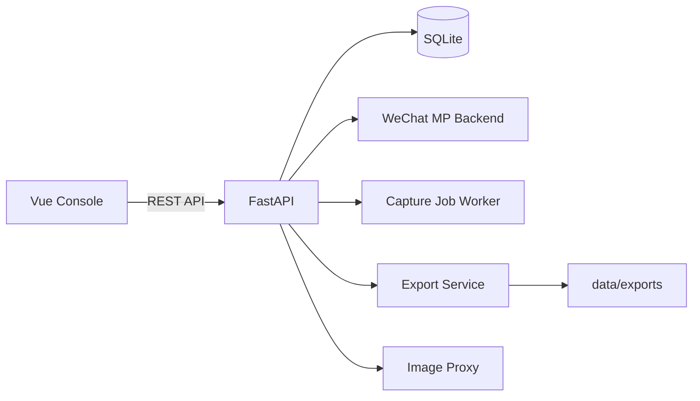
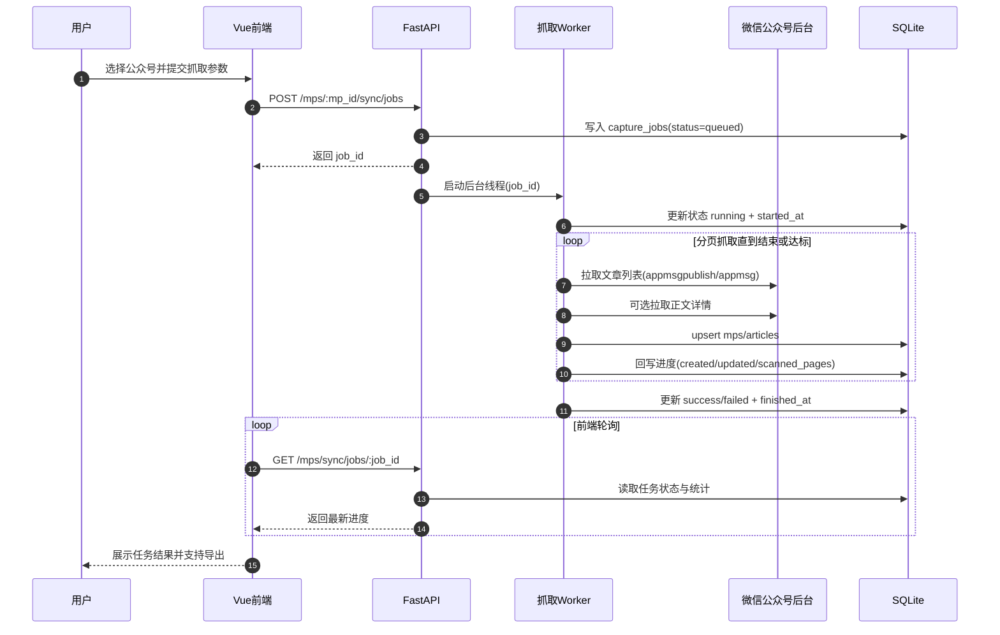

# mp-data-console · 公众号数据控制台


一个面向个人/小团队的微信公众号数据工作台：扫码登录、搜索确认、后台抓取、正文预览、导出、数据库浏览、MCP 配置，一站式完成。

## 这个项目解决什么问题

- 抓取流程繁琐：需要在登录、搜索、抓取、导出之间频繁切换。
- 抓取体验焦虑：过去“抓取中”会卡住页面，用户不敢离开。
- 数据可见性不足：抓了多少、重复多少、是否达到目标，不够透明。

这个项目的目标是把流程做成**低心智负担控制台**：任务提交到后台后可以离开页面，回来可继续查看状态与结果。

## 核心能力

### 抓取链路

- 扫码登录微信公众号后台（含状态轮询与会话恢复）
- 公众号搜索与抓取前确认（头像、别名、目标条数）
- 后台抓取任务（`queued/running/success/failed`）
- 去重计数：目标条数按“新增且不重复”文章计算

### 内容与导出

- 抓取文章列表 + 正文
- 正文在线预览（处理隐藏样式和图片防盗链问题）
- 导出 Markdown / HTML / PDF
- 批量导出 ZIP

### 数据与运维

- 数据库在线浏览（分页、关键词、指定字段搜索、精确过滤）
- 表注释 / 列注释展示
- MCP 文章文本服务配置一键生成（直连 SQLite）
- 图片代理与导出图片本地化，降低防盗链导致的丢图

## 架构概览



## 实现原理（核心机制）

### 1) 扫码登录 + 会话恢复

- 后端通过 `requests.Session` 模拟公众号后台会话，请求微信首页提取二维码参数；若页面结构变化，自动回退到 `startlogin + scanloginqrcode` 流程生成二维码。
- 轮询登录状态时，根据微信状态码映射为 `waiting_scan / scanned / logged_in / expired`，扫码成功后再调用登录接口完成 token 建立。
- token 不是单点来源：会从响应 JSON、URL、页面文本、Cookie、历史 token 多路提取，并用 `switchacct` 接口校验可用性，降低偶发失败。
- 会话信息（token、cookie、fingerprint、状态）持久化在 `auth_sessions`；服务重启后会自动恢复，并在 token 仍有效时回写为 `logged_in`。

### 2) 公众号与文章抓取

- 公众号先搜索后入库，按 `fakeid`（必要时 `biz`）做 upsert，避免重复创建。
- 抓取文章时优先使用 `appmsgpublish`，若返回空再回退 `appmsg`，提升兼容性。
- 每页按 5 条扫描，任务内用 `url + aid` 双键去重，重复项计入 `duplicates_skipped`。
- `target_count` 只按“新增文章数（created）”计数，已存在文章更新计入 `updated`，不占目标额度。

### 3) 后台任务执行模型

- 前端提交抓取后，后端先写入 `capture_jobs`（`queued`），再启动守护线程异步执行，不阻塞接口返回。
- 运行中持续把 `created/updated/content_updated/scanned_pages/max_pages/reached_target` 回写数据库，前端可轮询得到实时进度。
- 服务内用互斥锁保证同一时刻只跑一个抓取 worker，避免并发抓取导致登录态冲突与频控风险。
- 若进程异常重启，数据库里遗留的 `queued/running` 任务会在下次查询时自动标记为 `failed`，并提示“任务进程已中断”。



### 4) 正文解析与反爬兼容

- 正文抓取后使用 `BeautifulSoup` 解析 `#js_content/#js_article`，移除脚本样式，并清理 `visibility:hidden`、`opacity:0`、`display:none` 等常见隐藏样式。
- 图片链接统一回填到可用 `src`（优先 `data-src`），同时提取 `content_text`、封面、作者、发布时间等字段。
- 遇到“当前环境异常，完成验证后即可继续访问”页面时，自动回退 Playwright，并复用登录 cookie 获取可渲染正文。

### 5) 导出与图片防盗链处理

- Markdown 导出时将图片地址改写为本地图片代理接口，减少外链防盗链导致的失效。
- HTML/PDF 导出会尝试把正文图片下载到本地 `assets` 目录并重写相对路径；下载失败再降级为代理链接。
- 图片代理仅允许微信相关域名，使用 `sha256(url)` 做缓存键，二进制 + 元信息分离存储，默认 7 天 TTL，支持重试与内容类型嗅探。
- 批量导出时会把文章文件和对应 `assets` 一并打包 ZIP，下载接口带路径校验，防止越权读取。

## 环境要求

- Python 3.11+
- Node.js 20+
- Linux / macOS / Windows

如果需要 PDF 导出，请安装 Playwright 浏览器：

```bash
playwright install chromium
```

## 3 分钟上手（推荐）

```bash
./scripts/dev-up.sh
```

首次自动安装依赖：

```bash
./scripts/dev-up.sh --install
```

首次同时安装 PDF 导出依赖：

```bash
./scripts/dev-up.sh --install --install-playwright
```

停止服务：

```bash
./scripts/dev-down.sh
```

默认访问地址：

- 前端：`http://127.0.0.1:5173`
- 后端：`http://127.0.0.1:18011`
- API 文档：`http://127.0.0.1:18011/docs`

## 手动启动（可选）

### 后端

```bash
python3 -m venv .venv
source .venv/bin/activate
pip install -r requirements.txt
cp .env.example .env
uvicorn app.main:app --host 0.0.0.0 --port 18011 --reload
```

### 前端

```bash
cd web
npm install
cp .env.example .env
npm run dev
```

## 典型使用流程（UI）

1. 获取二维码并扫码登录
2. 搜索公众号并确认抓取目标
3. 设置抓取条数（去重计数）与是否抓正文
4. 提交抓取任务（任务进入后台执行，可离开当前页面）
5. 回来查看任务状态（新增/更新/重复跳过/扫描页数）
6. 在文章区预览正文并导出

## API 快速索引（默认前缀：`/api/v1`）

### 认证

- `GET /auth/qr`
- `GET /auth/qr/image`
- `GET /auth/status`
- `GET /auth/session`
- `POST /auth/logout`

### 公众号与抓取

- `GET /mps/search?keyword=关键词`
- `POST /mps`
- `GET /mps`
- `POST /mps/{mp_id}/sync/jobs`（后台任务，推荐）
- `GET /mps/sync/jobs`
- `GET /mps/sync/jobs/{job_id}`
- `POST /mps/{mp_id}/sync`（阻塞模式，兼容保留）

### 文章与导出

- `GET /articles`
- `GET /articles/{article_id}`
- `POST /articles/{article_id}/refresh`
- `POST /exports/article/{article_id}`
- `POST /exports/batch`
- `GET /exports/files/{relative_path}`

### 运维与工具

- `GET /ops/overview`
- `POST /ops/quick-sync`
- `GET /ops/db/tables`
- `GET /ops/db/table/{table_name}`
- `GET /ops/mcp/config`
- `POST /ops/mcp/generate-file`
- `GET /assets/image?url=<原图地址>`

## MCP 访问 SQLite 正文

项目内置了 MCP 服务模块 `app.mcp_server`，可直接读取 SQLite 中的文章正文文本（`articles.content_text`），便于在 Claude Desktop / Cursor 等 MCP 客户端里做问答、检索和摘要。

### 1) 安装

```bash
python3 -m venv .venv
source .venv/bin/activate
pip install -r requirements.txt
```

### 2) 本地启动 MCP（可选，用于调试）

```bash
python3 -m app.mcp_server --db-path "$(pwd)/data/wechat_mini.db"
```

### 3) 获取可直接粘贴的 MCP 配置

方式 A：在前端「MCP 配置」页点击“刷新配置 / 生成配置文件”  
方式 B：直接调用接口：

```bash
curl "http://127.0.0.1:18011/api/v1/ops/mcp/config"
```

返回中的 `config_json` 可直接用于客户端，例如：

```json
{
  "mcpServers": {
    "we-mp-mini-articles": {
      "command": "/abs/path/to/python",
      "args": [
        "-m",
        "app.mcp_server",
        "--db-path",
        "/abs/path/to/data/wechat_mini.db"
      ]
    }
  }
}
```

### 4) MCP 工具（读取正文）

- `list_mps`：列出库内公众号（含文章数量、正文数量）
- `list_articles_by_mp`：按公众号名或 `mp_id` 列出该号文章
- `db_overview`：查看公众号数、文章数、带正文文章数
- `search_articles`：按关键词搜索标题/正文，返回正文预览与文章 ID
- `get_article_text`：按 `article_id` 或 `url` 读取完整正文文本

建议流程：先用 `list_mps` / `list_articles_by_mp` 定位公众号和文章，再用 `get_article_text` 拉取全文。

## 请求示例

所有接口统一返回结构：

```json
{
  "ok": true,
  "message": "ok",
  "data": {}
}
```

提交后台抓取任务：

```bash
curl -X POST "http://127.0.0.1:18011/api/v1/mps/<mp_id>/sync/jobs" \
  -H "Content-Type: application/json" \
  -d '{"pages":4,"target_count":20,"fetch_content":true}'
```

查询任务状态：

```bash
curl "http://127.0.0.1:18011/api/v1/mps/sync/jobs/<job_id>"
```

返回中的关键字段：

- `status`：`queued` / `running` / `success` / `failed`
- `created`：新增文章数
- `updated`：已有文章更新数
- `duplicates_skipped`：重复跳过数
- `reached_target`：是否达到 `target_count`

## 去重与任务语义

- `target_count` 表示目标新增文章数（去重后计数）
- 同一任务内若重复（按 `url/aid`），会跳过并计入 `duplicates_skipped`
- 已存在文章会计入 `updated`，不会占用 `created` 目标条数
- 若源数据不足，任务可完成但 `reached_target=false`
- 后台任务依赖后端进程存活；重启后端会中断进行中的任务

## 常用配置

后端 `.env`（节选）：

| 变量 | 默认值 | 说明 |
|---|---|---|
| `APP_NAME` | `we-mp-mini` | 服务名称 |
| `API_PREFIX` | `/api/v1` | API 前缀 |
| `HOST` | `0.0.0.0` | 后端监听地址 |
| `PORT` | `18011` | 后端端口 |
| `DATABASE_URL` | `sqlite:///./data/wechat_mini.db` | SQLite 地址 |
| `REQUEST_TIMEOUT` | `20` | 微信请求超时（秒） |
| `VERIFY_SSL` | `true` | 是否校验证书 |

前端 `web/.env`（节选）：

| 变量 | 默认值 | 说明 |
|---|---|---|
| `VITE_API_BASE` | `/api/v1` | 前端请求前缀 |
| `VITE_DEV_API_TARGET` | `http://127.0.0.1:18011` | Vite 代理后端地址 |

## 项目结构

```text
app/
  core/           # 配置 + DB
  routers/        # API 路由
  services/       # 微信认证/抓取/导出/任务
  models.py       # SQLAlchemy 模型（含 capture_jobs）
  schemas.py      # Pydantic 模型
  mcp_server.py   # MCP 服务（读取 SQLite 文章正文）
  main.py         # FastAPI 入口
web/
  src/            # Vue 页面与 API 调用
  vite.config.js  # 开发代理配置
scripts/
  dev-up.sh       # 一键启动前后端
  dev-down.sh     # 停止前后端
data/             # 本地数据库/导出文件/缓存（默认不提交）
```

## FAQ

### 抓取中可以关闭页面吗？

可以。抓取任务提交后在服务端后台执行，回来后页面会继续展示任务状态。

### 为什么设置了 20 条但没抓满？

常见原因是源数据不足、限频或重复较多。此时任务会完成，但 `reached_target` 可能为 `false`。

### 任务为什么会失败？

常见原因包括登录态失效、微信风控限频、或后端进程重启导致任务中断。

### 为什么图片偶尔加载慢？

图片经过代理以规避防盗链，会多一次转发请求，首次加载可能慢于直连。

## 合规说明

- 仅抓取你有权限访问的账号内容
- 请遵守平台条款与当地法律法规
- 本项目定位研究/自用工具，不提供平台绕过能力
